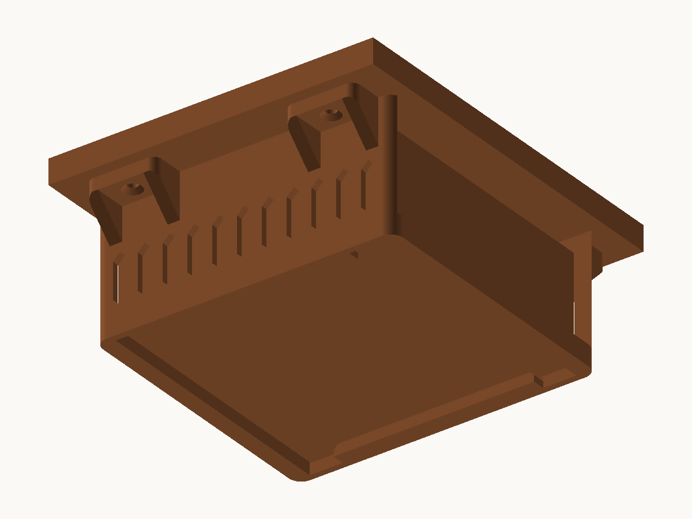
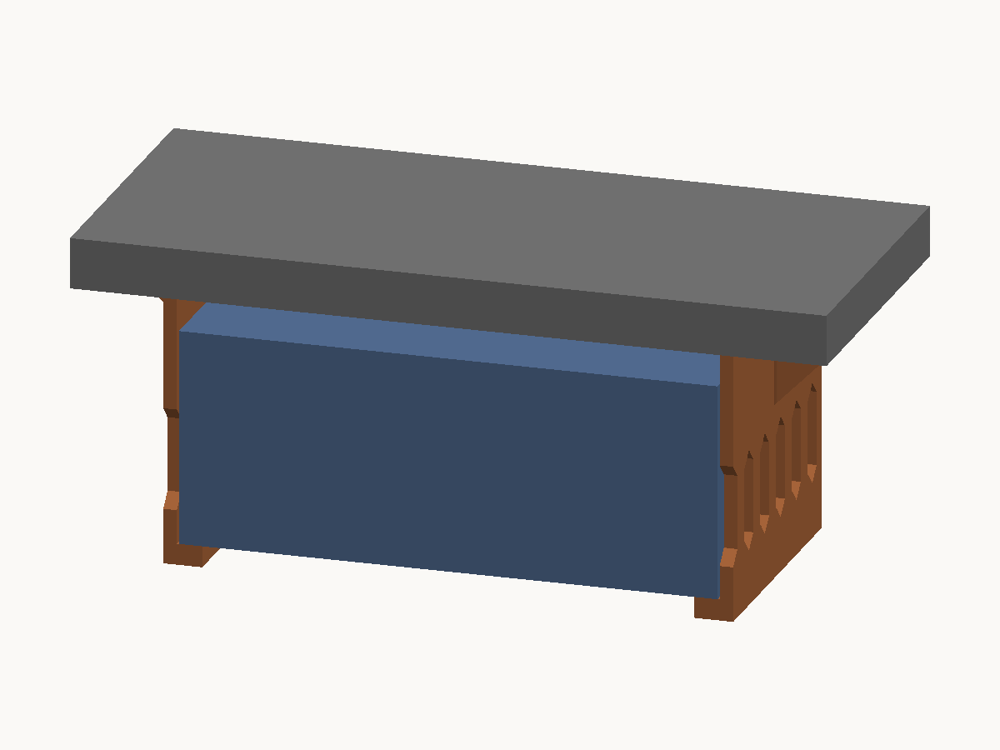

# Mac mini (M4) デスク下吊り下げマウント（一体成型）

Mac mini M4 をデスク天板の裏に吊り下げる、**一体成型**のクレードル。天板裏に木ビス4本で留め、本体を前から差し込む。




断面（グレー＝天板、青＝Mac mini、オレンジ＝マウント）。左が前から見た断面、右が横から見た断面:




```
［前から見た断面］

        天板
  ══════════════════════════════════════
   ▲ビス                        ▲ビス
  ┏━━━┓                        ┏━━━┓   ← フランジ（外向き）＋45°リブ
  ┃   ┃                        ┃   ┃
  ┃   ┃        Mac mini        ┃   ┃   ← 側板（縦スリットのルーバー）
  ┃   ┃                        ┃   ┃
  ┗━┓ ┃                        ┃ ┏━┛
    ┗━┛                        ┗━┛     ← 受け皿（左右のみ・底面中央は開放）
```

```
［横から見た断面］

        天板
  ══════════════════════════════════════
  ┃                                    ┃
  ┃            Mac mini                ┃
  ┃                                    ┃
  ┃▲                                  ▲┃  ← 前後の渡し材を5mm立ち上げて
  ┗┻━━━━━━━━━━━━━━━━━━━━━━━━━━━━━━━━━━┻┛     前後に抜けないようにしてある
```

## 設計の要点

- **ルーバーと角R**。側板は縦スリットの列（上下を45°の山形にした縦長六角形）。縦方向なので
  ブリッジが1つも出ず、Mac mini 本体のベントと語彙も揃う。外形の四隅と、フランジ・リブの角は R。
- **サポートなしで刷れる（実測で確認）**。造形方向に対して宙に浮いた下向きの面を、
  スクリプトが毎回パッチごとに切り出し、**両端支持のブリッジか片持ちかを判定**する。
  片持ちが 1 箇所でもあれば STL を出力せずに終了する。現状は片持ち 0.00 cm²、
  残るのはフランジ下面のリブ間ブリッジ 22 mm × 4 箇所だけ（52 箇所の宙浮き面すべてを判定した結果）。
- **左右が開かないので落ちない**。底が「左右の受け皿＋前後の渡し材」で閉じた枠になっているため、
  荷重やビスの緩みで左右の間隔が広がることがない。
- **底面中央を塞がない**。Mac mini M4 は底面のほぼ全体が円形の着脱式カバーで、
  その前半分が吸気・後半分が排気になっている。受け皿は側面から 7.5 mm だけ本体底面にかかり、
  **渡し材は本体の前後端より外側**に置いてあるので、底面中央には一切かからない。
- **本体を入れたままビスを締められる**。フランジを外向きにしたため、ビス4本すべてが本体の外側にある。
- **電源ボタンを避ける**。M4 世代は電源ボタンが底面の背面左寄りにある。受け皿は本体の前後端から
  15 mm 引っ込めてあるので、背面側の底面には指が入る。
- **前後の渡し材が 5 mm 立ち上がって本体を抱える**。本体が持ち上がれる量は 1.5 mm しかないので、
  この 5 mm は乗り越えられない。上下・左右・前後のすべてを拘束した状態になる。

## 既製モデルとの比較

Web で配布されている「Mac Mini M4 Mount v5」(3MF) を同じ判定基準にかけた結果。

| | 片持ち（要サポート） | 最長ブリッジ | 宙浮き合計 | 体積 |
|---|---|---|---|---|
| 既製モデル v5 | **13.44 cm²** | 32.0 mm | 26.98 cm² | 64.0 cm³ |
| この設計 | **0.00 cm²** | 22.0 mm | 12.04 cm² | 91.4 cm³ |

既製モデルは z=44 mm にあるフランジ下面 6.41 cm² × 2 箇所が完全な片持ち（リブなしで外へ張り出している）で、
サポートを付けずに刷ると必ず荒れる。この設計はそれを 45°リブで支えることで解消しているが、
そのぶん材料は 43% 増える。

## 寸法

| 項目 | 値 |
|---|---|
| 外形 | 145.0（前後）× 166.4（左右・フランジ含む）× 63.3（高さ）mm |
| 全高 | 63.3 mm（受け皿 5.0 + 内寸 52.3 + フランジ 6.0） |
| 側板内面の間隔 | 128.0 mm（本体 127.0 + 片側 0.5） |
| 本体が入る高さ | 52.3 mm（本体 50.8 + 余裕 1.5） |
| 受け皿が本体底面にかかる幅 | 5.5 mm |
| ビス穴 | 4箇所。前後 ±48 mm（96 mm 間隔）／左右 ±75.2 mm（150.4 mm 間隔） |
| 皿面取り | 開口 9.0 mm / 深さ 2.10 mm / 残り肉厚 3.90 mm |
| 材料 | 91.4 cm³ ≒ PLA 113 g / PETG 116 g |
| 必要個数 | **1個** |

本体上面と天板の間は 7.5 mm 空く（フランジ厚 6.0 + 余裕 1.5）。

### 本体が入る空間（実測で確認）

本体が占める領域の内側 20,181 点を点内外判定にかけて、**肉に当たる点が 0 個**であることを確認している。

| 方向 | 空き | 本体 | 余裕 |
|---|---|---|---|
| 左右 | 127.98 mm（側板内面どうし） | 127.0 mm | 片側 0.5 mm |
| 上下 | 52.3 mm（受け皿上面〜フランジ下面） | 50.8 mm | 1.5 mm |
| 前後 | 128.9 mm（渡し材どうし） | 127.0 mm | 片側 1.0 mm |

前後の渡し材は受け皿の上面から 5.0 mm 立ち上がっている。本体が持ち上がれる量は 1.5 mm なので、
**前後方向に抜けない**（実測: ストッパーの帯 z=9.5 での前後の空き 128.94 mm、動ける量 1.94 mm）。

## 取り付け手順

前後のストッパーが 5 mm あるため、**天板に留めたあとから本体を差し込むことはできない**（本体が
持ち上がれる量は 1.5 mm しかない）。先に本体を入れてから天板に留める。

1. マウントを作業台に置き、**Mac mini を上から落とし込む**。前後のストッパーの内側に収める。
2. マウントを天板裏の設置したい位置に当て、フランジの皿穴4箇所からビス位置を印す。
   本体を入れたまま位置を決められるので、実際の収まりを見ながら決められる。
3. いったん外して**下穴を開ける**（4.2 mm 木ビスなら φ2.5 mm 程度）。
4. 本体を入れた状態で天板裏に当て、木ビス4本で留める。皿頭が面取りに沈むまで締める。
   ビスは4本すべて本体の外側にあるので、本体を入れたままドライバーが入る。

本体を取り出すときはビスを緩めてマウントごと下ろす。

### 木ビスの選び方

- 呼び径 4.2 mm、皿頭またはラッパ頭。
- **長さ = 6 mm（フランジ厚）＋ 天板に入れたい深さ**。天板を貫通させないこと。
  例: 天板厚 25 mm なら 4.2 × 25 mm（木部に 19 mm 入る）。天板厚 18 mm なら 4.2 × 20 mm。
- 鍋頭・六角頭を使う場合は皿面取りが合わないので、`CS_HEAD_D` / `CS_ANGLE_DEG` を頭の形に合わせて変更する。

### 差し込み式に戻したい場合

`STOP_H` を本体上面の余裕 `FIT_TOP`（1.5 mm）未満にすれば、天板に留めたあとから前後どちらにも
差し込めるようになる（そのぶん抜けやすくなる）。あるいは `FIT_TOP` を `STOP_H` より大きくすれば
差し込めるが、全高が伸びて本体に上下のガタが出る。

## 未着手: 底面の円形への嵌合

底面の円形カバーの縁に沿った円弧リブを立てて前後方向も位置決めする案は、**寸法が未確認のため未着手**。
必要な実測値は次の2つ。

| 実測項目 | 何が決まるか |
|---|---|
| アルミリムの幅（外縁から黒い円形カバーの縁まで） | 受け皿の幅 `LIP_LEN`（現在 6.0 mm）と円弧リブの半径 |
| 円形カバーの段差（凹んでいるか・面一か・出ているか） | リブを円の内側に立てるか外側に立てるか |

Web 調査（Apple 公式 / iFixit / ChargerLAB / 配布モデル10件以上）では、**円形部の直径・深さ・リム幅は
いずれも数値が公開されていなかった**。フリーの3Dモデルも、底面の円形部を実測レベルで再現していると
明記したものは見つからなかった（作者自身が精度に留保を付けているものばかり）。

なお現在の受け皿は本体底面に 5.5 mm かかっている（底面の円形カバーは直径 116.0 mm までなら
受け皿に当たらない）。アルミリムがこれより狭い場合、**着脱式の円形カバーに荷重が乗る**ことになるので、
`LIP_LEN` をさらに狭める必要がある。

## その他の実測してほしいこと

| 実測項目 | 現在の前提 | 合わない場合 |
|---|---|---|
| 本体の実測高さ | 50.8 mm（2.0 インチ換算。Apple の cm 表記は 50 mm、ChargerLAB 実測は 49.7 mm） | `BODY_H` を変更 |
| 電源ボタンの位置 | 本体の前後端から 15 mm 以内、または側面から 7.5 mm 以上内側にあれば干渉しない | 干渉するなら `LIP_INSET` を大きくする |
| 側面/底面のエッジのR | R が大きいと本体がわずかに浮いて座る（実害はない） | 気になれば `FIT_TOP` を増やす |

## ファイル

| ファイル | 内容 |
|---|---|
| `macmini_underdesk_mount.py` | 形状定義兼 STL 生成スクリプト（trimesh + manifold3d が必要） |
| `macmini_underdesk_mount.stl` | 生成済み STL。**これを1個スライスする** |
| `assembly_preview.stl` | 組み付けイメージ（天板・本体・マウント）。**確認用で印刷不可** |
| `section_front_*.stl` / `section_side_*.stl` | 断面の3部品×2方向（マウント・本体・天板）。色分けプレビュー用 |
| `preview.py` | STL から確認用 PNG を描画（標準ライブラリのみ） |
| `mount_preview.png` / `mount_underside.png` / `assembly_preview.png` / `section_front.png` / `section_side.png` | 上の画像 |

## 生成しなおす

CSG（ブーリアン演算）を使うので venv が必要。

```sh
# 初回のみ
python3 -m venv .venv && .venv/bin/pip install trimesh manifold3d numpy rtree

.venv/bin/python macmini_underdesk_mount.py --assembly --section
python3 preview.py macmini_underdesk_mount.stl mount_preview.png --dir=-0.55,0.75,-0.60
python3 preview.py macmini_underdesk_mount.stl mount_underside.png --dir=-0.55,0.75,0.55
python3 preview.py assembly_preview.stl assembly_preview.png --dir=-0.55,0.75,0.55
python3 preview.py section_front_mount.stl section_front_body.stl section_front_desk.stl section_front.png --dir=0.90,0.28,-0.33
python3 preview.py section_side_mount.stl section_side_body.stl section_side_desk.stl section_side.png --dir=0.30,0.88,-0.36
```

`preview.py` に STL を複数渡すと、渡した順に色を変えて1枚に重ねて描く。

`rtree` は宙浮き面の判定（点の内外判定）に使う。

### スクリプトが毎回検証していること

STL に書き出して読み戻した状態で、以下をすべて満たさなければ STL を出力せずに終了する。

- 水密である（1辺を共有する面がちょうど2枚）
- 法線の向きが揃っている
- 退化三角形（面積0）が無い
- **片持ちの下向き面が無い**（宙に浮いた下向き面をパッチごとに切り出し、少し下の高さで
  XY バウンディングボックスの外側4方向を点内外判定でつつき、相対する2方向に肉があれば
  ブリッジ、片側しか支えが無ければ片持ちと判定する）
- **Mac mini の外形との干渉体積が 0**

主なパラメータ（`macmini_underdesk_mount.py` 冒頭）:

| パラメータ | 既定値 | 意味 |
|---|---|---|
| `BODY_W` / `BODY_D` / `BODY_H` | 127 / 127 / 50.8 | Mac mini の実寸 |
| `FIT_SIDE` / `FIT_TOP` | 0.5 / 1.5 | 側方（片側）・上方のクリアランス |
| `T_LIP` / `T_WALL` / `T_FLANGE` | 5.0 / 3.2 / 6.0 | 底枠・側板・フランジの厚み |
| `LIP_LEN` / `LIP_INSET` | 6.0 / 15.0 | 受け皿の内向き突出量／前後端からの引っ込み |
| `TIE_W` / `TIE_GAP` / `STOP_H` | 8.0 / 1.0 / 5.0 | 渡し材の幅・本体との隙間・前後の立ち上がり |
| `FLANGE_LEN` / `PAD_L` / `PAD_X` / `T_RIB` | 16.0 / 34.0 / ±48 / 6.0 | フランジの突出量・長さ・位置・リブ厚 |
| `SCREW_D` / `HOLE_D` / `CS_HEAD_D` | 4.2 / 4.8 / 9.0 | 木ビスの呼び径・下穴径・皿面取り開口径 |
| `LOUVER` / `LV_W` / `LV_PITCH` / `LV_SPAN` | True / 7.0 / 12.0 / 132.0 | ルーバーの有無・スリット幅・ピッチ・列の全長 |
| `LV_MARGIN` / `LV_TOP_GAP` | 8.0 / 4.3 | スリットと底枠・リブ根元の間に残す帯の幅 |
| `CORNER_R` / `PAD_R` | 6.0 / 4.0 | 外形四隅・フランジとリブの角R |

## 印刷設定（QIDI Q2）

**設置姿勢のまま**（STL はその姿勢で出力済み。回転不要）。145 × 166.4 mm の接地で、造形サイズ 270×270 に収まる。

| 項目 | 値 | 備考 |
|---|---|---|
| フィラメント | **PETG 推奨**（PLA も可） | 荷重が常時かかる部品なので、PLA のクリープと耐熱（Tg 約60℃）を避けられる PETG が無難 |
| ノズル | 0.4 mm | |
| レイヤー高さ | 0.2 mm | |
| 壁（外周）ループ数 | 4 | 側板 3.2 mm は 4 ループ×両面で中実になる。スリットの間の桟は 5 mm |
| 上面/底面ソリッド層 | 各 5 層 | |
| インフィル | 25%（Gyroid など） | 荷重は本体 0.73 kg ぶんだけなので余裕は大きい |
| **サポート** | **なし** | 片持ちの面が無いことをスクリプトで確認済み |
| ブリム | なし | 底枠の接地面積は約 4,600 mm² |

- 個数 **1個**。材料 約113 g（PLA）/ 約116 g（PETG）。印刷時間は**推測で6〜8時間程度**（実際の値はスライサーの見積もりを確認すること）。
- ブリッジは**フランジ下面のリブ間 22 mm × 4 箇所だけ**。ブリッジ設定は既定のままでよい。
  ルーバーは上下が 45°の山形なのでブリッジにならない。
- 側板は高さ 63.3 mm・厚み 3.2 mm の立ち壁になる。高速設定のままだと振動が出るなら、外壁速度を落とす。

> 排気口近傍の筐体表面温度が PLA のガラス転移点（約60℃）を超えるかは一次情報で確認できなかった（推測）。
> このマウントは本体の側面と底面の縁にしか接触せず、排気は底面から出るので直接は当たらないが、
> 心配なら PETG を選ぶか、放射温度計で排気口付近を実測してから決めるとよい。

## 出典

- 外形寸法・重量・ポート構成: [Mac mini (2024) 技術仕様 - Apple サポート](https://support.apple.com/en-us/121555)
- 実測 127.1 × 127.1 × 49.7 mm、底面中央の刻印: [Teardown of Apple M4 Mac mini (A3238) - ChargerLAB](https://www.chargerlab.com/teardown-of-apple-m4-mac-mini-a3238/)
- 底面が円形の着脱式カバー（4クリップ留め）: [Mac mini (2024) Bottom Cover Replacement - iFixit](https://www.ifixit.com/Guide/Mac+mini+(2024)+Bottom+Cover+Replacement/180193)
- 円形部の前半分が吸気・後半分が排気: [Mac mini 2024 Teardown - iFixit](https://www.ifixit.com/News/104302/all-hail-the-return-of-upgradeable-storage-mac-mini-2024-teardown)
- 電源ボタンが底面の背面左寄り: [M4 Mac Mini's Power Button Has New Bottom Location - MacRumors](https://www.macrumors.com/2024/10/29/m4-mac-mini-bottom-power-button/)
- 公式の VESA / ネジ穴によるマウント手段は存在しない（既存製品はすべてサードパーティの挟み込み式）

## ライセンス

MIT License. 詳細は [LICENSE](LICENSE) を参照。
