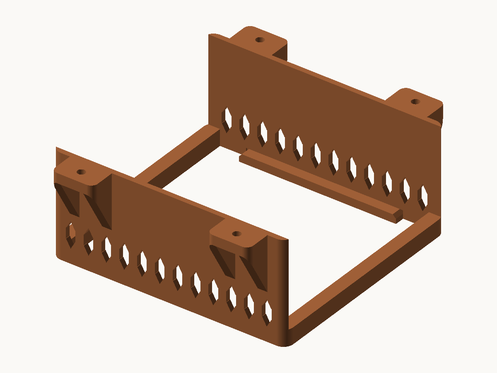
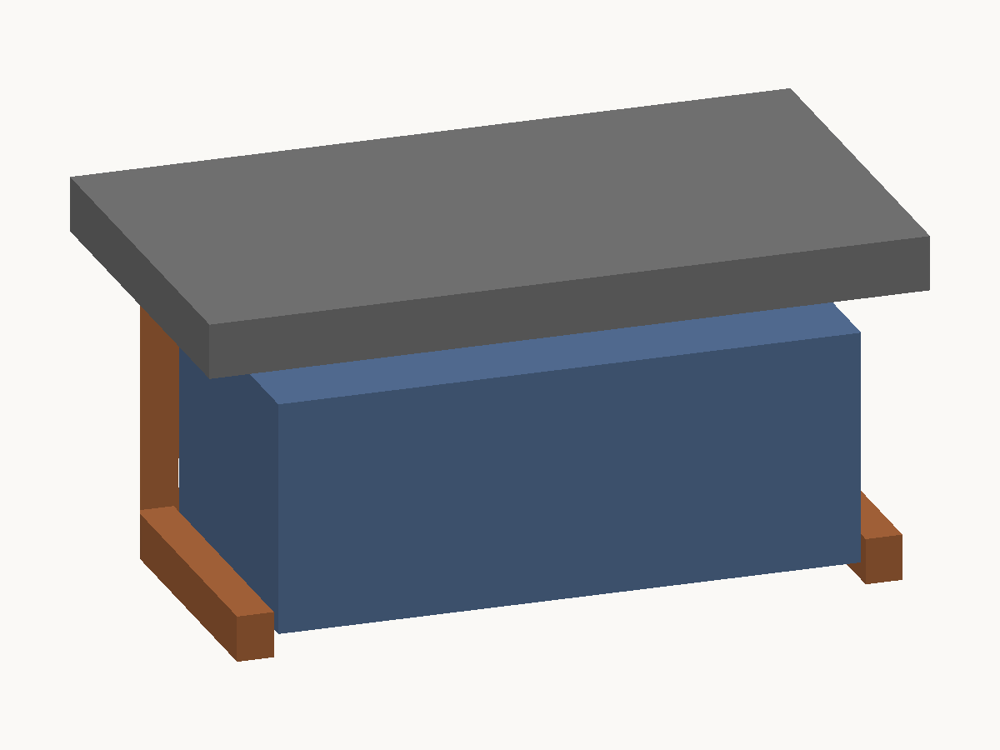

# Mac mini (M4) デスク下吊り下げマウント

Mac mini M4 をデスク天板の裏に吊り下げる一体成型のクレードル。木ビス4本で留め、本体は上から落とし込む。サポートなしで印刷できる。





## 仕様

| 項目 | 値 |
|---|---|
| 外形 | 145.0 × 166.4 × 63.3 mm |
| 対応機種 | Mac mini M4 / M4 Pro（127 × 127 × 50.8 mm） |
| ビス | 木ビス 呼び径 4.2 mm × 4本（皿面取り済み） |
| 材料 | 97.8 cm³ ≒ PLA 121 g / PETG 124 g |
| 個数 | 1個 |

- 底面中央の吸排気は塞がない（受け皿は側面から 5.5 mm だけ本体底面にかかる）
- 前後の渡し材が 5 mm 立ち上がって前後方向の滑り止めになる（持ち上げれば出し入れできる）
- ビス4本はすべて本体の外側にあるので、本体を入れたまま締められる

## 取り付け

フランジが外向きで本体の真上に肉が無いため、本体は天板まで 7.5 mm 持ち上がる。
前後のストッパーは 5 mm なので、**天板に留めたあとでも本体を出し入れできる**。

1. 天板裏に当ててビス位置を印し、下穴（φ2.5 mm 程度）を開ける
2. 木ビス4本で留める。皿頭が面取りに沈むまで締める
3. Mac mini を少し持ち上げながら前から差し込む

木ビスの長さ = 6 mm（フランジ厚）＋ 天板に入れたい深さ。天板を貫通させないこと。
例: 天板厚 25 mm なら 4.2 × 25 mm。

## 印刷設定

PETG 推奨（PLA も可）／ノズル 0.4 mm ／レイヤー 0.2 mm ／壁 4 ループ ／上下ソリッド各 5 層 ／
インフィル 25% ／ブリムなし。STL は設置姿勢のまま出力してあるので回転不要。

**サポートは「なし」で刷る。** 自己支持させる面（リブとルーバーの山）は水平から 60° に立ててあり、
スライサーの既定しきい値（55°前後）より急なので、自動サポートを使っても付かない。
55° 未満で残るのは次の2つだけ。

| 面 | 傾き | 面積 | |
|---|---|---|---|
| フランジ下面（リブ間） | 0° | 6.76 cm² | 14 mm のブリッジ。架かる |
| 皿面取りの円錐 | 45° | 2.57 cm² | φ9 mm・深さ 2.1 mm の浅い窪み |

自動サポートを使う場合は、しきい値を 40° 程度に下げるとこの2箇所にも付かない。

## 生成しなおす

```sh
python3 -m venv .venv && .venv/bin/pip install trimesh manifold3d numpy rtree
.venv/bin/python macmini_underdesk_mount.py --assembly --section
python3 preview.py macmini_underdesk_mount.stl mount_preview.png --dir=-0.55,0.75,-0.60
```

寸法は `macmini_underdesk_mount.py` 冒頭のパラメータで変えられる。設計の意図と、スクリプトが毎回行う検証
（水密性・オーバーハングの片持ち判定・Mac mini との干渉）は同ファイルの docstring に書いてある。

`preview.py` は STL から確認用 PNG を描くだけのもので、標準ライブラリしか使わない。複数の STL を渡すと色を変えて重ねる。

## TODO

- 底面の円形カバーへの嵌合。アルミリムの幅と段差の実測待ち
- 画像を実物の写真に差し替え

## 出典

- 外形寸法・重量: [Mac mini (2024) 技術仕様 - Apple](https://support.apple.com/en-us/121555)
- 底面が円形の着脱式カバーで、前半分が吸気・後半分が排気: [Mac mini 2024 Teardown - iFixit](https://www.ifixit.com/News/104302/all-hail-the-return-of-upgradeable-storage-mac-mini-2024-teardown)

## ライセンス

MIT License. 詳細は [LICENSE](LICENSE) を参照。
